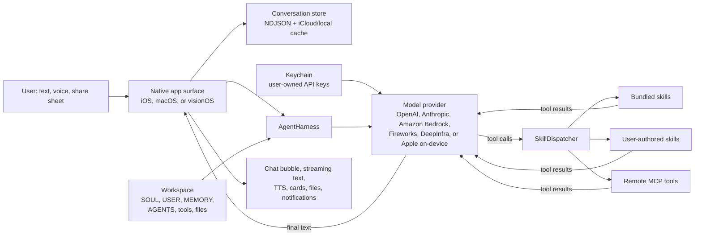
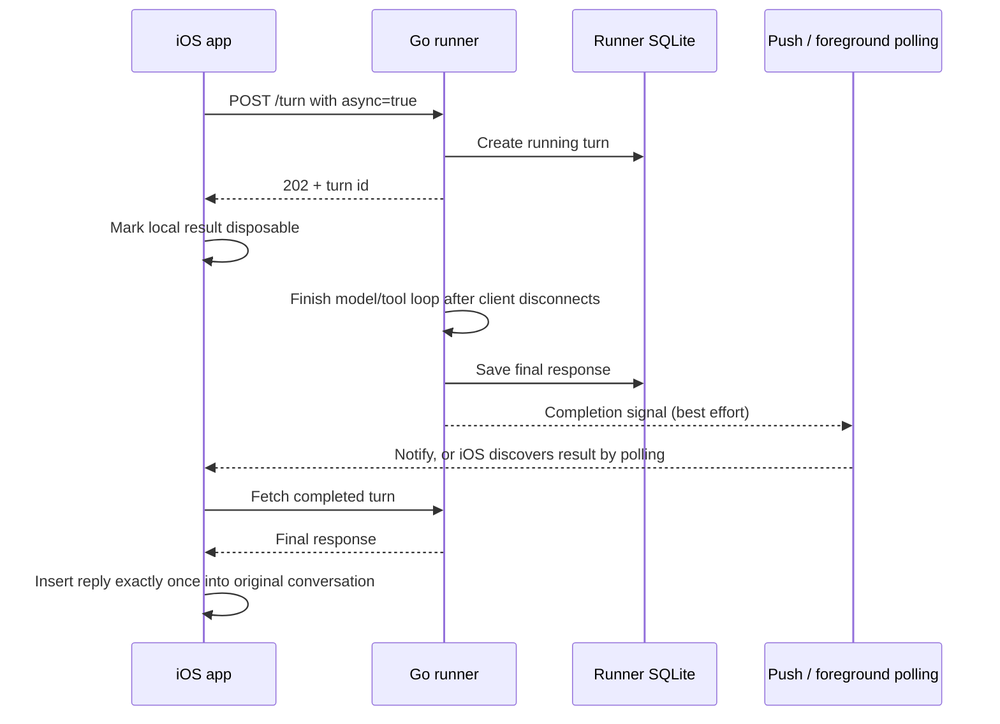

# How LoopHarness Works

LoopHarness is the engine behind **Loop**, a native personal assistant for iOS,
macOS, and visionOS. The short version is:

> A native UI captures a typed or spoken request, saves it locally, gives a
> model the conversation plus Loop's memory and available tools, executes any
> tools the model requests, and repeats until the model returns a final answer.

The model is the planner; LoopHarness is the runtime that supplies context,
executes actions, persists state, and presents the result.

## The system at a glance



There is no required Loop cloud service in the main local path. Hosted model
requests go directly from the app to the selected provider using a key stored
in the user's Keychain. Conversation and workspace data prefer iCloud Drive
and fall back to local storage when iCloud is unavailable.

## What happens at app launch

The details differ by platform, but all three apps converge on the same shared
conversation, model, skill, and persistence code.

### iOS

1. [`AppDelegate.swift`](../LoopIOS/AppDelegate.swift) initializes Keychain and
   iCloud-backed preferences, registers scheduled/background work, starts the
   runner and remote-message pollers, and wires notification routing.
2. [`ConversationFileStore.swift`](../LoopIOS/Data/ConversationFileStore.swift)
   resolves the iCloud conversation folder in the background. It first loads
   lightweight conversation metadata, then hydrates full message history so
   startup does not block on iCloud downloads.
3. [`MessagingVC.swift`](../LoopIOS/MessagingVC.swift) restores the active
   conversation, connects the message box and voice UI, and starts the agent
   workspace bootstrap.
4. [`AgentHarness.swift`](../LoopIOS/AgentHarness/AgentHarness.swift) loads the
   self-documents and discovers bundled, user-authored, and MCP skills. On iOS
   this happens asynchronously; a very early chat waits for it without freezing
   the UI.
5. When the scene becomes active,
   [`SceneDelegate.swift`](../LoopIOS/SceneDelegate.swift) reconciles scheduled
   jobs, drains shared attachments, and starts foreground polling for remote
   results.

### macOS

[`LoopMacApp.swift`](../LoopMac/LoopMacApp.swift) creates the floating recorder,
conversation window, global push-to-talk hotkey, and Mac-only skills such as app
launching and terminal control. A per-conversation
[`VoiceLoopCoordinator.swift`](../LoopMac/VoiceLoopCoordinator.swift) then drives
voice and text turns through the shared harness.

### visionOS

[`LoopVisionApp.swift`](../LoopVision/LoopVisionApp.swift) creates a volumetric
orb and a separate conversation window backed by one shared session.
Pinch-and-hold voice input flows through
[`VisionVoiceCoordinator.swift`](../LoopVision/VisionVoiceCoordinator.swift) and
then into the same harness and conversation store.

## What happens during a normal turn

The primary path below is implemented by
[`MessagingVC.swift`](../LoopIOS/MessagingVC.swift),
[`Cloud.swift`](../LoopIOS/Data/Cloud.swift), and
[`AgentHarness.swift`](../LoopIOS/AgentHarness/AgentHarness.swift). `Cloud` is a
small compatibility shim; `AgentHarness` owns the actual routing.

```mermaid
sequenceDiagram
    actor User
    participant UI as Native conversation UI
    participant Store as Conversation store
    participant Harness as AgentHarness
    participant Model as Selected model
    participant Tools as SkillDispatcher / skill

    User->>UI: Send text, transcript, or attachment
    UI->>Store: Persist user message immediately
    UI->>Harness: Send persisted conversation context
    Harness->>Harness: Load self-docs and select relevant tools
    Harness->>Model: System prompt + history + tool schemas
    Model-->>UI: Stream partial response text

    alt Model asks to use tools
        Model->>UI: Return one or more tool calls
        UI->>Store: Persist assistant tool-call message
        par Tool calls can run concurrently
            UI->>Tools: Dispatch tool call A
            UI->>Tools: Dispatch tool call B
        end
        Tools-->>Store: Persist function results
        UI->>Harness: Send updated conversation back to model
        Note over Harness,Tools: This loop repeats until there are no tool calls
    else Model returns final text
        Model-->>UI: Final assistant message
    end

    UI->>Store: Persist final assistant message
    UI-->>User: Render bubble; optionally speak or notify
```

In more concrete terms:

1. **Capture and persist.** The UI creates a `MessageStruct`, attaches any file
   or speech-engine metadata, and writes it to the current conversation before
   inference begins. This makes the user's input durable even if the request
   later fails.
2. **Build context.** The harness combines conversation history with a system
   prompt assembled from `SOUL.md`, `USER.md`, `MEMORY.md`, `AGENTS.md`,
   `HEARTBEAT.md`, and the available tool descriptions. These workspace files
   are meant to make the assistant inspectable and editable.
3. **Reduce the tool set.** [`ToolRouter.swift`](../LoopIOS/AgentHarness/ToolRouter.swift)
   chooses the skill groups relevant to the latest request so every call does
   not carry the full catalog. Ambiguous requests can still receive the broad
   set.
4. **Choose a model route.** Online requests go directly to the selected
   OpenAI, Anthropic, Amazon Bedrock, Fireworks, or DeepInfra client. Apple Foundation Models are used
   when selected or when the device is offline and the on-device model is
   available. If an attachment needs vision and the chosen model cannot see
   images, that turn can be routed to a vision-capable model.
5. **Stream and inspect the response.** Plain assistant text ends the loop. A
   response containing function calls enters the tool path instead.
6. **Execute tools.** [`SkillDispatcher.swift`](../LoopIOS/AgentHarness/SkillDispatcher.swift)
   routes each call to a bundled skill, a Mac-only registered handler, a
   user-authored dynamic skill, or an MCP server. Multiple calls from one model
   response can run in parallel in the main chat flow.
7. **Guard against loops.** [`ToolCallGuard.swift`](../LoopIOS/AgentHarness/ToolCallGuard.swift)
   can block repeated calls and return a structured result to the model instead
   of allowing an accidental tool loop to consume time and quota.
8. **Continue the loop.** Tool results are saved as function messages and the
   expanded conversation is sent back through the harness. The model may ask
   for more tools or return its final answer.
9. **Finish.** The final message is saved and rendered. The active surface can
   speak a sanitized version with TTS; if the app is backgrounded, iOS can post
   a completion notification instead.

## Where state lives

| State | Storage | Purpose |
| --- | --- | --- |
| Conversations | One NDJSON file per conversation in iCloud Drive, with a local fallback | Durable chat history shared across Apple devices |
| Agent self-documents and files | Sandboxed iCloud workspace, with a local Documents fallback | Editable identity, user context, memory, skills, and generated files |
| API keys and remote secrets | Apple Keychain | Provider credentials and SSH secrets |
| Lightweight preferences and scheduler records | `UserDefaults` / iCloud key-value preferences where applicable | Model, voice, UI, backend, and scheduled-job settings |
| Portable runner state | SQLite on the VM | Remote turns and tool jobs that survive runner restarts |

[`Workspace.swift`](../LoopIOS/Workspace/Workspace.swift) is the safety boundary
for agent-visible files: paths are resolved relative to the workspace, traversal
is rejected, and individual reads/writes are capped at 1 MB.

[`ConversationStore.swift`](../LoopIOS/Data/ConversationStore.swift) abstracts
where a conversation lives. The default implementation is the local/iCloud
file store. A conversation may instead belong to a configured remote execution
backend, and the router keeps conversations isolated by their owning backend.

## The important alternate paths

### Voice input and output

Voice is an input/output layer around the same turn loop:

```text
hold/tap gesture -> microphone recording -> STT -> user MessageStruct
                 -> normal agent/tool loop -> final text -> sanitize -> TTS
```

Deepgram and Apple speech recognition are supported by the shared speech
pipeline. TTS is also provider-selectable. The conversation remains text at
rest, so typed and spoken turns share the same history.

### Sub-agents

A model can call the sub-agent skill for a focused background task.
[`SubAgentManager.swift`](../LoopIOS/SubAgents/SubAgentManager.swift) creates and
tracks the child, while
[`SubAgentRuntime.swift`](../LoopIOS/SubAgents/SubAgentRuntime.swift) gives it a
scoped prompt and runs its own model/tool loop. Its private working transcript
does not become the main chat; when it finishes, a summary is posted back to
the parent conversation. Research/general agents have runtime limits, while
coding agents are designed to continue until completion or manual cancellation.

### Local Codex agents on macOS

The Mac target can also delegate repository work to the locally installed
[Codex app server](https://developers.openai.com/codex/app-server). Loop owns
one newline-delimited JSON connection to `codex app-server --listen stdio://`,
performs the required `initialize` handshake, and maps each dispatched task to
a Codex thread and turn.

[`CodexSkill.swift`](../LoopMac/Codex/CodexSkill.swift) exposes project
discovery, single-agent dispatch, three-project fan-out, listing, continuation,
and cancellation to the main Loop model. [`CodexAgentService.swift`](../LoopMac/Codex/CodexAgentService.swift)
persists the project/job registry and posts terminal results back into the
conversation that launched them. The Mac Integrations window provides the same
project registry and job details directly to the user.

Safety is project-scoped: history-discovered and newly added projects default
to `readOnly`; `workspaceWrite` must be enabled explicitly for that registered
directory, only one write agent may run per project, and Loop never requests
`dangerFullAccess`. App-server turns use `approvalPolicy: never`, so an action
that cannot run inside the selected sandbox fails closed instead of leaving an
unattended approval prompt. If Loop quits during a turn, the persisted job is
marked interrupted at the next launch and can be continued on its existing
Codex thread.

### Scheduled work

[`BackgroundScheduler.swift`](../LoopIOS/Skills/Scheduler/BackgroundScheduler.swift)
stores jobs and pre-generates results near their notification time. macOS uses
timers; iOS combines notifications, `BGProcessingTask`, and a foreground
catch-up path because iOS background execution is opportunistic. A prefetched
result is written to a conversation, and tapping its notification opens that
result; if prefetch did not run, the app can execute the prompt live.

### Remote OpenClaw conversations

The user can select an SSH VM execution backend. New conversations created
while it is active belong to that backend. Messages and transcripts are routed
through [`OpenClawConversationStore.swift`](../LoopIOS/Data/OpenClawConversationStore.swift),
and the app streams through a gateway connection or polls the remote transcript
instead of starting local model inference. Switching backends changes which
conversation list is shown; it does not move or merge conversations.

### Portable Go runner and background handoff

The optional runner under [`runtime/go/`](../runtime/go/) is a smaller, portable
agent runtime for a VM. It is separate from the much larger native skill
catalog.

On startup, [`main.go`](../runtime/go/main.go) loads configuration, opens a
SQLite database, registers its tools, and exposes authenticated HTTP endpoints.
For `POST /turn`, [`agent.go`](../runtime/go/agent/agent.go) calls OpenAI,
streams text, dispatches requested tools, and repeats until it has a final
answer. Local runner tools execute in-process; device-tagged tools go through a
device bridge.

The iOS app can hand an in-flight local turn to this runner when the app truly
enters the background:



The runner currently has only `echo` and `web_fetch` as working local tools.
Its `read_calendar` device route and direct APNs bridge are scaffolding unless
the missing push/device pieces are configured and implemented. Polling the
runner's `/turns` and `/jobs` endpoints is the dependable result-recovery
path.

## A useful mental model

Think of LoopHarness as five cooperating layers:

1. **Surface** — native chat, orb, recorder, share sheet, notifications.
2. **State** — conversations, memory documents, workspace files, preferences,
   and credentials.
3. **Harness** — prompt composition, model selection, context management, and
   tool-schema selection.
4. **Action loop** — model requests tools; dispatchers run them; results return
   to the model until it is done.
5. **Background/remote execution** — sub-agents, scheduling, OpenClaw backends,
   and the optional portable runner keep work going outside a foreground turn.

Most new capabilities fit into one of two places: a new **surface** that feeds
the shared turn loop, or a new **skill** that the model can call from that loop.
